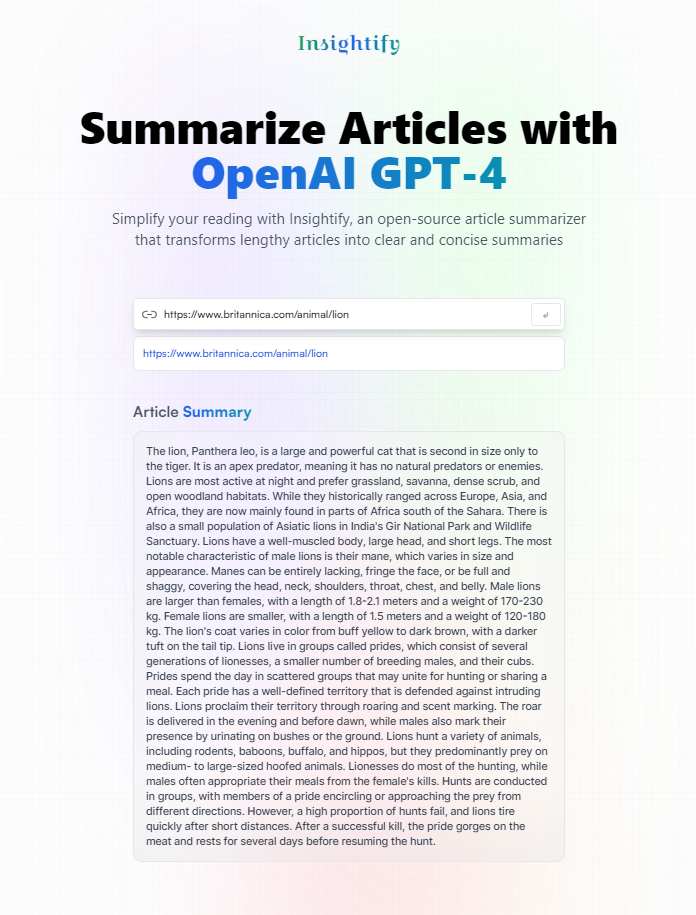

# Insightify - OpenAI Article Summarizer

Insightify is an openAI-powered article summarizer developed using React, Vite, Redux Toolkit, and Tailwind CSS. It allows users to summarize articles by providing a URL and also provides a history of saved URLs along with their summaries.

## Demo

Check out the deployed site: [Insightify Demo](https://rizmiya-article-summarizer.surge.sh/)

## Features

- Summarize articles by entering their URLs.
- Save URL history with their respective summaries.
- Utilizes the Rapid API - Article Extractor and Summarizer for accurate article extraction and summarization.
- A user-friendly and intuitive interface.

## Acknowledgments

- Thanks to OpenAI for providing the article summarization capabilities.
- Thanks to Rapid API for the Article Extractor and Summarizer.