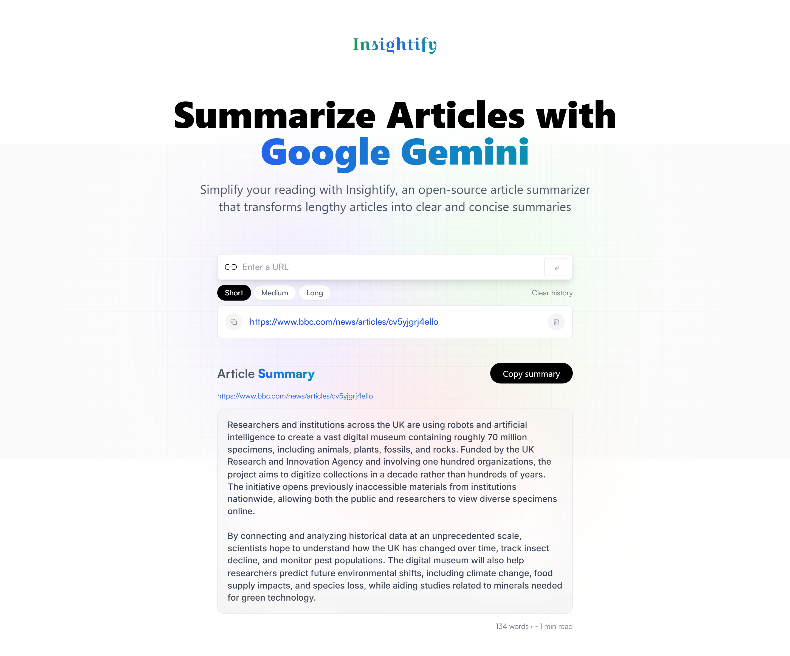

# Insightify - AI Article Summarizer

Insightify is an AI-powered article summarizer (using Google Gemini) developed using React, Vite, Redux Toolkit, and Tailwind CSS. It allows users to summarize articles by providing a URL and also provides a history of saved URLs along with their summaries.

## Demo

Check out the deployed site: [Insightify Demo](https://rizmiya-article-summarizer.surge.sh/)

## Features

- Summarize articles by entering their URLs.
- Save URL history with their respective summaries.
- Extracts article text with Mozilla Readability and summarizes it with Google Gemini through a serverless API, so the API key never reaches the browser.
- Choose summary length (Short / Medium / Long).
- Copy a summary or URL to the clipboard with one click.
- Delete individual history items or clear the whole history.
- Previously summarized URLs load instantly from history (no extra API call).
- Word count and estimated reading time for each summary.
- A user-friendly and intuitive interface.

## Getting Started

1. Install dependencies: `npm install`
2. Copy `.env.example` to `.env` and add your free Gemini API key from [Google AI Studio](https://aistudio.google.com/apikey) (no payment card needed).
3. Start the dev server: `npm run dev` (serves the React app and `/api/summarize`)

## Deploying to Vercel

1. Import the repository in [Vercel](https://vercel.com/new) (framework preset: Vite), or run `npx vercel`.
2. In Project Settings → Environment Variables, add `GEMINI_API_KEY`.
3. Deploy. The function in `api/summarize.js` is picked up automatically.

## Acknowledgments

- Thanks to Google for the Gemini API, which powers the summaries.
- Thanks to Mozilla Readability for article extraction.